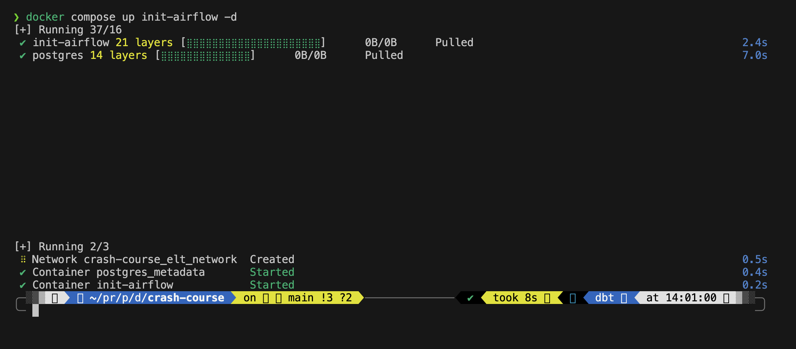
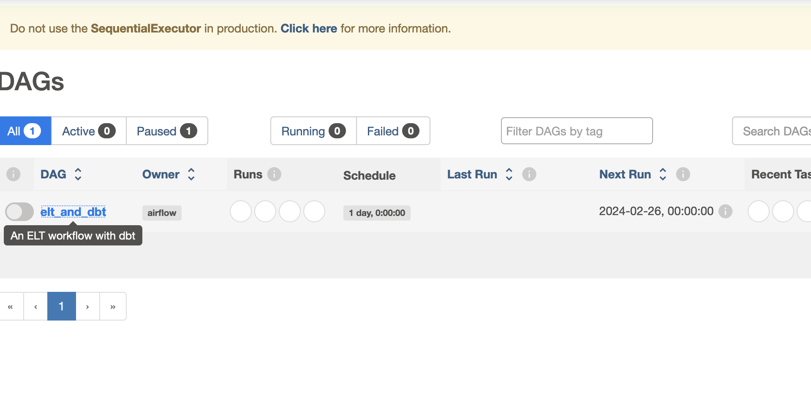
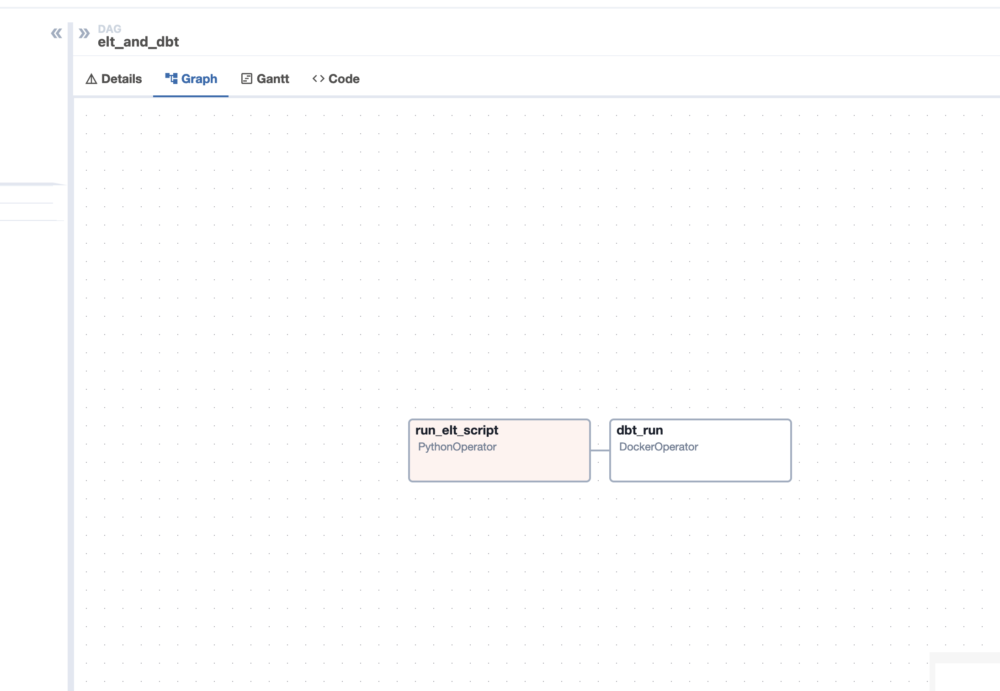
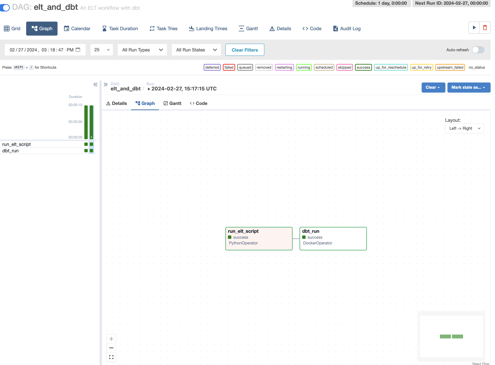
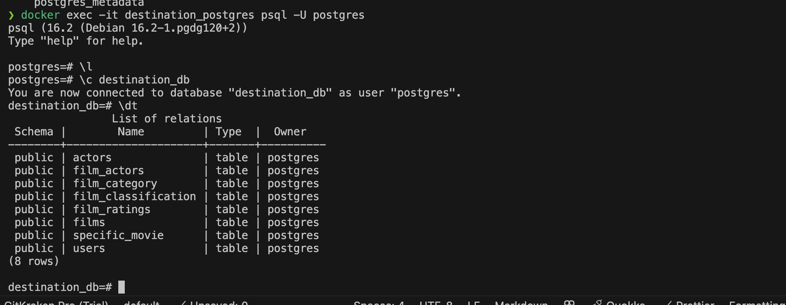

Continuing with Apache Airflow, we will now see how to install and configure it.

## Installation

We are using docker compose to install Apache Airflow. You can find the docker-compose.yml file in the repository. We will setup the dags, webserver, and scheduler.

In brief, Apache airflow is a platform to programmatically author, schedule, and monitor workflows. Use airflow to author workflows as directed acyclic graphs (DAGs) of tasks. The airflow scheduler executes your tasks on an array of workers while following the specified dependencies. Rich command line utilities make performing complex surgeries on DAGs a snap. The rich user interface makes it easy to visualize pipelines running in production, monitor progress, and troubleshoot issues when needed. When workflows are defined as code, they become more maintainable, versionable, testable, and collaborative.

We first need to run initialize the airflow and the metadata database. We will use the `airflow db init` command to initialize the database that is already in the container init-airflow.

```bash
docker compose up init-airflow -d
```



Now run the whole cluster with the task scheduler, webserver, and the worker.

```bash
docker compose up --build --force-recreate
```

Now head to `http://localhost:8080/` and you will see the Apache Airflow UI.
The credentials are `airflow` and `password` as we set them. In production, you should change the password and it should not be mentioned in the docker-compose.yml file or readme...



Inside the UI, you can see the DAGs, the tasks, and the logs. You can also see the tree view of the tasks and the graph view of the tasks.



You can also see the logs of the tasks and the status of the tasks.



We can get into the container and see the data inside the container.

```bash
docker exec -it destination_postgres-1 psql -U postgres
```

Now you can see the data inside the container database.


